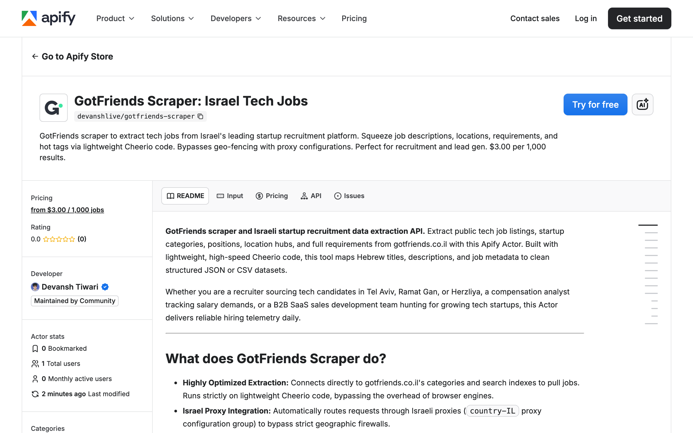

<div align="center">

# GotFriends Scraper | Israel Tech Startup Jobs | Apify Actor

[](https://apify.com/devanshlive/gotfriends-scraper) [](https://nodejs.org/) [](https://www.typescriptlang.org/) [](https://apify.com/devanshlive/gotfriends-scraper) [](https://cheerio.js.org/)

**GotFriends scraper and Israeli startup recruitment data extraction API.** Pull tech job titles, startup category descriptors, location hubs, full Hebrew descriptions, requirements, and trending indicators from gotfriends.co.il with this Apify Actor. Built on lightweight Cheerio code with Israel proxy support. Free tier included.

Whether you are a recruiter sourcing elite tech candidates in Tel Aviv or Herzliya, a compensation analyst tracking Israeli tech salaries, or a B2B sales development team hunting for expanding startups, this Actor delivers clean, structured datasets.

[Quick Start](#quick-start) · [Output Schema](#output-schema) · [Pricing](#pricing) · [FAQ](#faq)

</div>



---

## What is GotFriends Scraper?

**GotFriends scraper and Israeli startup recruitment data extraction API.** This Apify Actor turns [gotfriends.co.il](https://www.gotfriends.co.il) (Israel's premier tech and startup recruitment platform) into clean structured JSON with Hebrew titles, category descriptors (like "AI Startup"), location hubs, full descriptions, requirements, and hot-or-sponsored indicators.

Built for Israeli tech recruiters, dev-tool B2B vendors, compensation platforms, and lead generation teams that need Tel Aviv tech hiring data without copy-pasting from job boards.

## Why use GotFriends Scraper?

- **Israeli tech market focus** - GotFriends exclusively serves startups and high-tech companies. Sourcing Hebrew and English tech roles from Tel Aviv, Ramat Gan, and Herzliya.
- **Israel proxy ready** - Strict geographic firewall (geo-fence) bypassed via Apify Israel Proxy Group (`country-IL`). Works with datacenter or residential proxies inside Israel.
- **Lightweight Cheerio** - Runs on static HTTP requests, no headless browser overhead. Fast category walks across the entire jobs lobby.
- **Hot job indicator** - Each row includes an `isHot` flag for trending or sponsored roles, useful for B2B outreach timing.
- **Tech category filtering** - Pull only what you need: `software`, `ai`, `security`, `qa`, `devops`, `data`, `mobile`, or the special `graduates` lane for Mamram / 8200 military intelligence veterans.
- **Deduplicated vacancies** - Unique job codes extracted from listing paths. Track only fresh postings in your incremental syncs.
- **Lower price** - $1.80 per 1,000 jobs. 40% below the typical $3.00/1k competitors.

## Quick Start

```bash
npm install apify-client
```

```javascript
import { ApifyClient } from 'apify-client';

const client = new ApifyClient({ token: process.env.APIFY_TOKEN });

const run = await client.actor('devanshlive/gotfriends-scraper').call({
  category: 'software',
  location: 'tel-aviv',
  searchQuery: 'React',
  maxItems: 500,
});

const { items } = await client.dataset(run.defaultDatasetId).listItems();
console.log(items);
```

## How to use

1. Open the Actor in [Apify Console](https://apify.com/devanshlive/gotfriends-scraper)
2. Set **Tech Category** to filter by lane (`software`, `ai`, `security`, `qa`, `devops`, `data`, `mobile`, or `graduates`)
3. Set **Location Filter** to a Hebrew name or English slug (e.g. `tel-aviv`, `herzliya`, `haifa`)
4. Optionally set **Search Query** for a tech stack keyword like `React` or `Golang`
5. Configure **Proxy Configuration** with Apify Israel Proxy Group (`country-IL`) to bypass the geo-fence
6. Click **Start** and download the dataset as JSON, CSV, or Excel

You do not need GotFriends cookies, a GotFriends account, or a separate GotFriends API key.

## What data does it extract?

| Field | Description |
|---|---|
| `jobId` | Unique numeric ID parsed from the listing path (e.g. `74821` from `/jobslobby/software/74821/`) |
| `url` | Direct URL of the GotFriends vacancy card |
| `jobTitle` | Job title (Hebrew) |
| `company` | Extracted descriptive text of the employer (e.g. `סטארט-אפ בתחום ה-AI`) |
| `category` | Job category classification (`software`, `ai`, `devops`, etc.) |
| `location` | Primary location parsed from description text (Hebrew) |
| `jobDescription` | Core job description and company overview |
| `requirements` | Specific professional experience and tech requirements |
| `isHot` | `true` if the position is marked as a trending or urgent job |
| `scrapedAt` | ISO 8601 scraping timestamp |

## Output Example

```json
{
  "jobId": "74821",
  "url": "https://www.gotfriends.co.il/jobslobby/software/74821/",
  "jobTitle": "Full Stack Developer בחברת סטארט-אפ בתחום ה-AI",
  "company": "סטארט-אפ בתחום ה-AI",
  "category": "software",
  "location": "תל אביב",
  "jobDescription": "פיתוח ותחזוקה של מערכת ווב מבוססת React ו-Node.js\nעבודה עם מסדי נתונים PostgreSQL ו-MongoDB...",
  "requirements": "3+ שנות ניסיון בפיתוח Full Stack\nניסיון עם React, TypeScript, Node.js...",
  "isHot": true,
  "scrapedAt": "2026-03-26T12:00:00.000Z"
}
```

## Pricing

**$1.80 per 1,000 results.** Free tier included.

High-quality Israeli startup and tech vacancy data at 40% less than the typical $3.00/1k competitors. Standard residential or datacenter proxy data transfer applies when routing through Israel.

| Items scraped | Cost (USD) |
|---|---|
| 100 | $0.18 |
| 500 | $0.90 |
| 1,000 | $1.80 |
| 5,000 | $9.00 |
| 10,000 | $18.00 |

## Advanced Options

- **Israel Proxy Group** - For optimal results, ensure your proxy configuration uses Apify Israel Proxy Group (`country-IL`). Datacenter or residential proxies both bypass the geo-fence.
- **Precise Sourcing Filters** - Set `category` to targeted lanes like `graduates` to fetch Mamram / 8200 military intelligence veterans, or `ai` for AI-specific roles.

## Supported URL types

- `https://www.gotfriends.co.il/jobslobby/software/` (category lobby)
- `https://www.gotfriends.co.il/jobslobby/software/74821/` (direct vacancy)
- `https://www.gotfriends.co.il/jobslobby/ai/` (AI category)

## Use cases

- Source elite tech candidates from Tel Aviv, Herzliya, Ramat Gan startup ecosystem
- Track hiring trends across Israeli AI, cyber security, and DevOps sectors
- Generate B2B leads targeting Israeli startups with active engineering hiring
- Build candidate pipelines for specific tech stacks (React, Golang, Python, Kubernetes)
- Benchmark Israeli tech compensation by category and seniority

## FAQ

### Why does the scraper require an Israeli proxy?

GotFriends utilizes a strict geographic firewall (geo-fence) that immediately blocks or times out connections originating from datacenter IPs or networks outside of Israel (such as AWS us-east-1). This Actor automatically defaults to using Apify Israel Proxy Group (`country-IL`) to route requests natively and avoid blocks.

### Do I need a login or API Key?

No. All GotFriends vacancy listings are fully public and require no authentication or cookies to read.

### Why is the company name sometimes a description instead of a brand?

To prevent competitors and other recruiters from poaching clients, GotFriends hides the actual registered brand name of the employer in the listing. Instead, they use descriptions (e.g., `בחברת סטארט-אפ בתחום ה-AI` meaning "AI Startup Company"). The scraper extracts these descriptive texts so you still capture high-quality target insights.

## Disclaimers

This Actor is an independent web scraping tool and is not affiliated with, endorsed by, or sponsored by GotFriends, GotFriends Limited, gotfriends.co.il, or any of their subsidiaries or affiliates. All trademarks are the property of their respective owners.

The scraper accesses only the public, unauthenticated job listings of the GotFriends website, matching data the platform serves to any public user. Users are responsible for ensuring compliance with GotFriends Terms of Service and local data regulations (GDPR).

## Support

- GitHub Issues: https://github.com/getascraper/how-to-scrape-gotfriends/issues
- Apify Console: https://console.apify.com/actors/devanshlive~gotfriends-scraper/issues
